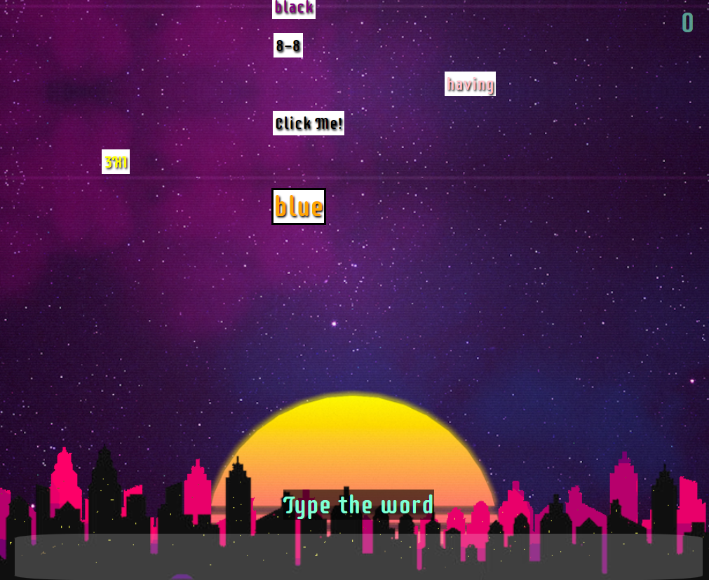

# Zero Fall



## Technologies Used:
- Javascript
- HTML
- CSS
- Coffee (as in the drink)

## Getting Started: 

[Play Here](https://briabar.github.io/bomberwords/)

Click the link above to play the game.
1. When you've mentally steeled yourself hit the spacebar
2. follow the instructions on the screen to destroy bombs
3. if the bombs hit your city everyone you know dies by burning...
4. ...and your score gets reset!


## Notable code snippits:

The following array full of functions is pretty cool.

```javascript
const bombFunctions = [
    //array of functions for creating bombs, used by bombDetails
    () => { 
        // regular words
        let randWord = wordList[Math.floor(Math.random() * (wordList.length))];
        return {
            word: randWord,
            color: colorList[Math.floor(Math.random() * (colorList.length))],
            question: "Type the word",
            answer: randWord,
            click: false,
        }
    },
    () => { 
        //color mixups
        let randColor = colorList[Math.floor(Math.random() * (colorList.length))];
        let randChoice = Math.floor(Math.random() * 2);
        if (randChoice === 0) {
            return {
                word: colorList[Math.floor(Math.random() * (colorList.length))],
                color: randColor,
                question: "Type the color",
                answer: randColor,
                click: false,
            }
        }
        else {
            return {
                word: randColor,
                color: colorList[Math.floor(Math.random() * (colorList.length))],
                question: "Type the word",
                answer: randColor,
                click: false,
            }
        }
    },
    () => {
        //clickables
        return {
            word: "Click Me!",
            color: colorList[Math.floor(Math.random() * (colorList.length))],
            question: "Click it!",
            answer: undefined,
            click: true,
        }
    },
    () => { //math
        let randChoice = Math.floor(Math.random() * 3);
        let x = Math.floor(Math.random() * 10);
        let y = Math.floor(Math.random() * 10);
        console.log(randChoice, gameLevel);
        if (randChoice === 0) {
            //add
            return {
                word: `${x}+${y}`,
                color: colorList[Math.floor(Math.random() * (colorList.length))],
                question: 'Do math!',
                answer: `${x + y}`,
                click: false,
            }
        }
        else if(randChoice === 1) {
            return {
                //sub
                word: `${x}-${y}`,
                color: colorList[Math.floor(Math.random() * (colorList.length))],
                question: 'Do math!',
                answer: `${x - y}`,
                click: false,
            }
        }
        else if (randChoice === 2) {
            //mult
            return {
                word: `${x}X${y}`,
                color: colorList[Math.floor(Math.random() * (colorList.length))],
                question: 'Do math!',
                answer: `${x * y}`,
                click: false,
            }
        }
    },
]
```

## Next Steps: 
1. Add a backend to save high scores and make a leader board.
2. add more bomb types.
3. create user feedback system for incorrect moves.
